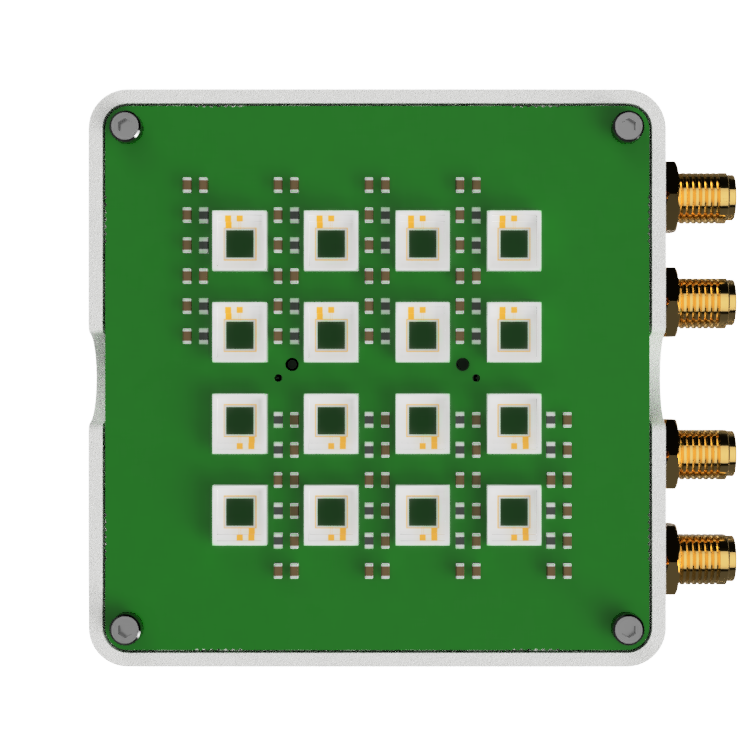

# FastIC+ readout mechanical
This repository contains the mechanical files of the FastIC+ readout enclosure. The source files from Fusion 360 are provided aswell as 3D printable exported meshes for the [top](top.3mf) and [bottom](bottom.3mf) parts. The PCB design files for the [readout board](https://github.com/WojtaCZ/fastic-readout-hw) aswell as the [user board](https://github.com/WojtaCZ/fastic-userboard-hw) are available in separate repositories.

  

  
   </img>
   

  
   </img>
   

## 3D printing recomendation
The two components of the top part of the case are exported as one 3MF file but can be printed either separately (if only a single material 3D printer is available) or combined, on a multi material printer. To print the parts joined in Cura, one needs to select both of them after importing the 3MF, right click and select "Merge". Than, if "Ungroup" is selected, the material for each part of the print can be chosen. If printed separately, the two top components are to be glued together.

## Metal inserts and screws
M2 metal inserts with the length of ~3.5 mm and outside diameter of 3.5 mm were used in the design. These can be sourced for example from Bossard ([1386840](https://www.bossard.com/eshop/ch-en/threaded-inserts-for-pressin-for-plastic-materials/threaded-inserts-for-hot-or-ultrasound-embedding-without-head-opposed-helical-knurl-for-thermoplastics/p/1052/?category=02.300.200.20&index=3&q=%3Arelevance&selected-article=1386840&variants-query=%3Arelevance%3Acode%3A1386840)) and need to be fitted into the top part as seen on the cross section image bellow. For all the screws, an M2 hex head with the length of 20mm is considered and can be sourced from Bossard as well ([3055298](https://www.bossard.com/eshop/ch-en/screws/screws-and-bolts-with-internal-drive/hex-socket-head-cap-screws-fully-threaded/p/7/?category=01.100.100.10&index=10&q=%3Arelevance%3A74EC6A2E-3795-43DB-A517-12F3521785C5%3AHexagon%2Bsocket&selected-article=3055298&variants-page=0&variants-query=%3Arelevance%3Acode%3A3055298)).

  

